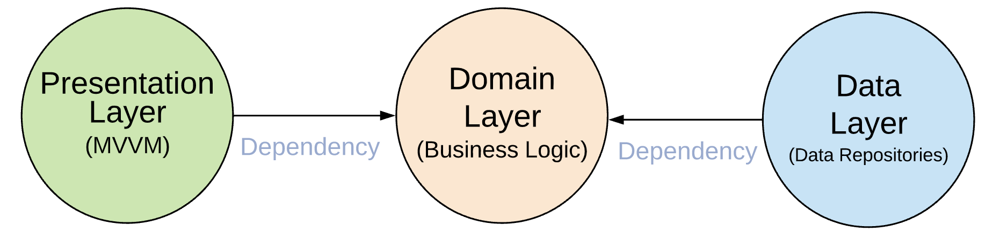
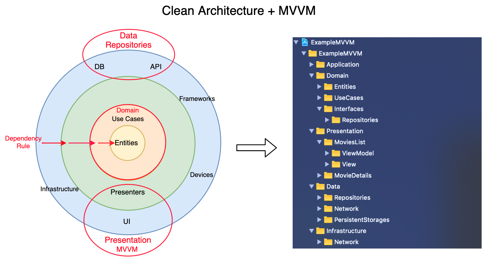
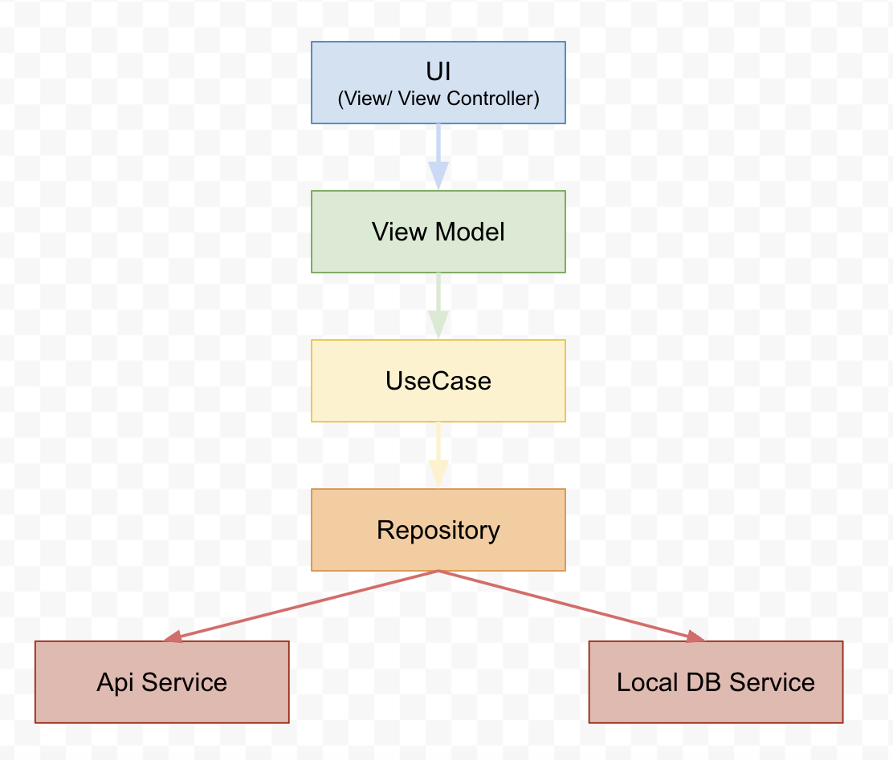

# 🎯 iOS Template App — Clean Architecture + MVVM + Unit Tests

This project is an iOS application template using **MVVM** and **Clean Architecture** principles. It demonstrates separation of concerns, testability, and scalability with both **UIKit and SwiftUI**.

✅ Use this as a base for your next production-grade iOS app.

---

## 📐 Layers Overview

```
Presentation (MVVM) → Domain (Use Cases) → Data (Repositories, API, DB)
```


| Layer              | Responsibilities                            |
|--------------------|----------------------------------------------|
| ✅ **Presentation** | ViewModels, Coordinators, Views (UI)        |
| ✅ **Domain**       | Entities, Use Cases, Protocols               |
| ✅ **Data**         | Repository implementations, Networking, DB  |

> 🧭 All layers follow the dependency rule — domain is isolated.

---

## 💡 Key Concepts

- ✅ **MVVM** — ViewModel acts as the binder between UI and logic
- ✅ **Clean Architecture** — separation of layers by responsibility
- ✅ **Dependency Injection** — DIContainer for composition
- ✅ **Coordinator Pattern** — flow management per scene
- ✅ **DTO Mapping** — maps raw API to domain-safe models
- ✅ **Error Handling** — handled cleanly across layers

---

## 🧪 Unit Testing

Test coverage for:
- ✅ Use Cases (Domain)
- ✅ ViewModels (Presentation)
- ✅ NetworkService (Infrastructure)

> Run with `⌘+U` or via `fastlane scan`.

---

## 🧱 Project Structure



```
ExampleMVVM/
├── Application/
│   └── DIContainer/
├── Domain/
│   ├── Entities/
│   ├── UseCases/
├── Data/
│   ├── Repositories/
│   ├── Network/
├── Presentation/
│   ├── ViewModels/
│   ├── Views/
│   └── Flows/
└── Infrastructure/
    └── Networking/
```


---

## ✨ Features

- ✅ Pagination for movie search
- ✅ Offline caching of queries
- ✅ SwiftUI & UIKit demo in same layer
- ✅ Dark Mode support
- ❌ Firebase (not included)
- ❌ Push Notifications (not configured)

---

## 🧪 How to Use

1. Run the app in Xcode 11+ (Swift 5.0+)
2. Search for a movie
3. Network request fetches results and poster images
4. Search query is saved persistently

---

## 📦 Technologies

- Swift 5
- UIKit / SwiftUI
- Clean Architecture
- MVVM Pattern
- REST Networking
- Unit Testing (XCTest)
- CI-ready (Travis + Fastlane)

---

## 🛠 Requirements

- Xcode 11.2.1+
- Swift 5.0+

---

## 📚 Learn More

- [Clean Architecture by Uncle Bob](https://blog.cleancoder.com/uncle-bob/2012/08/13/the-clean-architecture.html)
- [Advanced iOS Architecture (raywenderlich)](https://www.raywenderlich.com/8477-introducing-advanced-ios-app-architecture)
- [Original Project](https://github.com/kudoleh/iOS-Clean-Architecture-MVVM)

---

## 🎬 Demo

https://user-images.githubusercontent.com/6785311/236615779-153ef846-ae0b-4ce8-908a-57fca7158b9d.mp4
